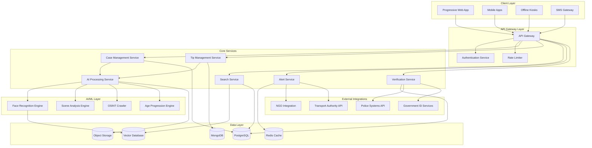

# Design Document: National Missing Person Discovery Platform

## Overview

The National Missing Person Discovery Platform is a cloud-native, microservices-based system designed to operate at national scale across India. The platform combines traditional case management with advanced AI capabilities, ensuring robust privacy protection while maximizing discovery potential. The architecture prioritizes rural accessibility, multi-language support, and integration with existing law enforcement infrastructure.

The system serves multiple user types through role-based interfaces: families managing cases, citizens browsing and submitting tips, police officers coordinating searches, and NGOs providing support services. All interactions are mediated through privacy-preserving mechanisms with explainable AI providing transparency in automated processes.

## Architecture

### High-Level Architecture



### Microservices Architecture

The platform follows a domain-driven design with bounded contexts:

- **Case Management Domain**: Handles missing person case lifecycle
- **Discovery Domain**: Manages search, tips, and matching
- **Verification Domain**: Coordinates police and NGO workflows  
- **AI/Intelligence Domain**: Provides automated analysis and matching
- **Privacy Domain**: Ensures compliance and data protection
- **Communication Domain**: Manages alerts and notifications

Each service is independently deployable with its own database, following the database-per-service pattern. Services communicate through event-driven architecture using Apache Kafka for reliable message delivery.

## Components and Interfaces

### Case Management Service

**Responsibilities:**
- Create, update, and manage missing person cases
- Handle photo and document uploads
- Maintain case audit trails and edit history
- Coordinate case closure workflows

**Key Interfaces:**
```typescript
interface CaseManagementService {
  createCase(caseData: CaseCreationRequest): Promise<Case>
  updateCase(caseId: string, updates: CaseUpdateRequest): Promise<Case>
  getCase(caseId: string): Promise<Case>
  closeCase(caseId: string, resolution: CaseResolution): Promise<void>
  getCaseHistory(caseId: string): Promise<CaseAuditTrail[]>
}

interface Case {
  id: string
  personalInfo: PersonalInformation
  lastSeenInfo: LastSeenInformation
  photos: Photo[]
  documents: Document[]
  status: CaseStatus
  createdAt: Date
  updatedAt: Date
  auditTrail: AuditEntry[]
}
```

### AI Processing Service

**Responsibilities:**
- Facial recognition and embedding generation
- Scene analysis and landmark detection
- Age progression/regression processing
- OSINT crawling and content analysis
- Match scoring and ranking

**Key Interfaces:**
```typescript
interface AIProcessingService {
  generateFacialEmbedding(photo: Photo): Promise<FacialEmbedding>
  performAgeProgression(photo: Photo, targetAge: number): Promise<Photo>
  analyzeScene(photo: Photo): Promise<SceneAnalysis>
  findSimilarFaces(embedding: FacialEmbedding, threshold: number): Promise<Match[]>
  crawlOSINTSources(caseId: string): Promise<OSINTResult[]>
}

interface Match {
  caseId: string
  confidence: number
  explanation: MatchExplanation
  visualSimilarity: SimilarityHeatmap
  source: MatchSource
}
```

### Search and Discovery Service

**Responsibilities:**
- Provide case search and filtering
- Generate map-based visualizations
- Handle QR code generation
- Manage search analytics

**Key Interfaces:**
```typescript
interface SearchService {
  searchCases(criteria: SearchCriteria): Promise<SearchResults>
  getCasesInRadius(location: GeoLocation, radius: number): Promise<Case[]>
  generateQRCode(caseId: string): Promise<QRCode>
  getSearchAnalytics(timeRange: TimeRange): Promise<SearchAnalytics>
}

interface SearchCriteria {
  location?: GeoFilter
  demographics?: DemographicFilter
  timeRange?: TimeRangeFilter
  keywords?: string[]
  sortBy?: SortOption
}
```

### Tip Management Service

**Responsibilities:**
- Accept and process citizen tips
- Handle anonymous submissions
- Manage tip verification workflows
- Route sensitive tips to appropriate channels

**Key Interfaces:**
```typescript
interface TipService {
  submitTip(tip: TipSubmission): Promise<TipId>
  getTipsForCase(caseId: string): Promise<Tip[]>
  updateTipStatus(tipId: string, status: TipStatus): Promise<void>
  rankTips(caseId: string): Promise<RankedTip[]>
}

interface TipSubmission {
  caseId: string
  content: TipContent
  location?: GeoLocation
  timestamp: Date
  isAnonymous: boolean
  attachments?: Attachment[]
}
```

### Privacy and Compliance Service

**Responsibilities:**
- Encrypt and protect biometric data
- Manage consent workflows
- Handle data retention policies
- Generate compliance reports

**Key Interfaces:**
```typescript
interface PrivacyService {
  encryptBiometricData(data: BiometricData): Promise<EncryptedData>
  verifyConsent(caseId: string, consentType: ConsentType): Promise<boolean>
  applyPrivacyFilters(content: Content, userRole: UserRole): Promise<FilteredContent>
  generateComplianceReport(timeRange: TimeRange): Promise<ComplianceReport>
}
```

## Data Models

### Core Entities

```typescript
interface PersonalInformation {
  name: string
  age: number
  gender: Gender
  height?: number
  weight?: number
  physicalMarkers: PhysicalMarker[]
  medicalConditions?: string[]
}

interface LastSeenInformation {
  location: GeoLocation
  timestamp: Date
  clothing: ClothingDescription
  circumstances: string
  witnesses?: WitnessInformation[]
}

interface Photo {
  id: string
  url: string
  type: PhotoType // front, side, old, etc.
  uploadedAt: Date
  metadata: PhotoMetadata
  facialEmbedding?: FacialEmbedding
}

interface FacialEmbedding {
  vector: number[] // 512-dimensional embedding
  model: string
  confidence: number
  landmarks: FacialLandmark[]
}

interface Tip {
  id: string
  caseId: string
  submitterId?: string
  content: TipContent
  location?: GeoLocation
  timestamp: Date
  confidence: number
  status: TipStatus
  verificationNotes?: string
}

interface GeoLocation {
  latitude: number
  longitude: number
  accuracy?: number
  address?: string
  landmark?: string
}
```

### Database Schema Design

**PostgreSQL (Structured Data):**
- Cases table with JSONB columns for flexible metadata
- Users table with role-based access control
- Tips table with spatial indexing for location queries
- Audit_logs table for compliance tracking

**MongoDB (Document Storage):**
- Case documents and rich media metadata
- OSINT crawl results and analysis data
- Search analytics and user behavior data

**Vector Database (Facial Embeddings):**
- High-dimensional facial embeddings with metadata
- Similarity search with configurable distance metrics
- Batch processing capabilities for large-scale matching

## Correctness Properties

*A property is a characteristic or behavior that should hold true across all valid executions of a system—essentially, a formal statement about what the system should do. Properties serve as the bridge between human-readable specifications and machine-verifiable correctness guarantees.*

Let me analyze the acceptance criteria to determine which can be converted into testable properties:

<function_calls>
<invoke name="prework">
<parameter name="featureName">missing-person-platform

Based on the prework analysis, I'll now convert the testable acceptance criteria into correctness properties:

### Property 1: Case Creation and Management Integrity
*For any* valid case submission with required fields (name, age, location, photo), the Case_Manager should create a case with a unique identifier, generate audit trails for all modifications, and preserve complete edit history with timestamps.
**Validates: Requirements 1.1, 1.2, 1.3, 1.5**

### Property 2: Case Authorization and Closure
*For any* case closure request, only authorized users should be able to close cases, and unauthorized users should be rejected while maintaining audit logs.
**Validates: Requirements 1.4**

### Property 3: Search Filtering and Result Completeness
*For any* search criteria (location, demographics, time range), the Search_Engine should return only cases matching all specified filters, and all results should contain required fields (photos, basic details, last seen information).
**Validates: Requirements 2.2, 2.3, 2.4**

### Property 4: QR Code Generation Validity
*For any* valid case, the Search_Engine should generate a valid QR code that correctly encodes case information.
**Validates: Requirements 2.5**

### Property 5: Tip Processing and Content Handling
*For any* tip submission (text, photo, video, location), the Tip_System should accept the content, capture location data with timestamps, assign confidence rankings, and route sensitive content to appropriate channels.
**Validates: Requirements 3.1, 3.2, 3.4, 3.5**

### Property 6: Anonymous Tip Processing
*For any* tip marked as anonymous, the Tip_System should process it without requiring user identification while maintaining all other processing capabilities.
**Validates: Requirements 3.3**

### Property 7: Alert Broadcasting and Targeting
*For any* published case, the Alert_System should broadcast notifications only to users within the configured radius, and rural users should receive SMS alerts for regional cases.
**Validates: Requirements 4.1, 4.5**

### Property 8: Disaster Response Activation
*For any* disaster event, the Alert_System should activate broadcast mode and send mass notifications to affected areas.
**Validates: Requirements 4.3**

### Property 9: External System Integration
*For any* integration request from railway stations, shelters, hospitals, NGOs, or transport authorities, the system should provide appropriate data feeds and dashboard access based on authorization level.
**Validates: Requirements 4.4, 11.3, 11.4**

### Property 10: Verification Workflow Completion
*For any* case requiring verification, police officers should be able to complete review workflows, validate FIR documents, and enable national publication upon approval.
**Validates: Requirements 5.1, 5.2, 5.3**

### Property 11: Inter-jurisdictional Information Sharing
*For any* inter-state coordination request, the Verification_System should facilitate secure information sharing between authorized jurisdictions.
**Validates: Requirements 5.5**

### Property 12: AI Processing and Confidence Scoring
*For any* image processed by the AI_Engine, facial recognition should produce confidence scores within valid ranges (0-1), scene analysis should detect landmarks and extract text, and age progression should generate valid facial representations.
**Validates: Requirements 6.1, 6.2, 6.5**

### Property 13: OSINT Scanning and Source Coverage
*For any* OSINT scanning request, the AI_Engine should search specified sources (social platforms, news sites, image repositories) and return results from expected source types.
**Validates: Requirements 6.3**

### Property 14: Match Explanation Completeness
*For any* AI-generated match, the result should include confidence scores, visual similarity heatmaps, and explainable reasoning components.
**Validates: Requirements 6.4**

### Property 15: Biometric Data Encryption
*For any* biometric data (facial embeddings, biometric information), the Privacy_Guardian should encrypt the data before storage and ensure it remains encrypted at rest.
**Validates: Requirements 7.1**

### Property 16: Minor Photo Protection
*For any* case involving minors, photos should be automatically blurred unless police approval is obtained and documented.
**Validates: Requirements 7.2**

### Property 17: Guardian Consent Verification
*For any* case involving children, the Privacy_Guardian should require and verify guardian consent before case publication.
**Validates: Requirements 7.3**

### Property 18: Photo Watermarking and Legal Access
*For any* publicly displayed photo, watermarking should be applied, and court orders should enable controlled deep search access with complete audit logging.
**Validates: Requirements 7.4, 7.5**

### Property 19: Multi-language Processing
*For any* voice input or image text extraction, the Platform should support processing in specified Indian languages (Hindi, English, major regional languages).
**Validates: Requirements 8.2, 8.3**

### Property 20: Offline Functionality and Bandwidth Optimization
*For any* user with limited connectivity, the Platform should provide offline functionality through kiosks/SMS and optimize bandwidth usage for rural accessibility.
**Validates: Requirements 8.4, 8.5**

### Property 21: Duplicate Detection and Prevention
*For any* case submission, the Platform should detect duplicates, prevent submission of duplicates, and suggest existing similar cases.
**Validates: Requirements 9.1**

### Property 22: Security and Fraud Prevention
*For any* suspicious activity or account creation, the Platform should implement rate limiting, fraud detection, and Sybil-resistant verification while maintaining tamper-proof audit logs.
**Validates: Requirements 9.2, 9.3, 9.4**

### Property 23: Content Moderation and Penalties
*For any* identified false report, the Platform should implement appropriate penalty mechanisms and content moderation workflows.
**Validates: Requirements 9.5**

### Property 24: Performance and Scalability
*For any* search query at scale (tens of millions of records), response time should be sub-second, and the system should auto-scale during traffic surges while maintaining service availability through load balancing.
**Validates: Requirements 10.1, 10.2, 10.5**

### Property 25: Media Processing Efficiency
*For any* image or video upload, processing should be completed efficiently through dedicated clusters, and rural users should benefit from edge caching.
**Validates: Requirements 10.3, 10.4**

### Property 26: Secure API Access
*For any* police system or government ID verification request, the Platform should provide secure, authenticated API access through proper gateways.
**Validates: Requirements 11.1, 11.2**

### Property 27: Legal Evidence Export
*For any* data export request for legal proceedings, the Platform should generate valid evidence documentation that meets legal requirements.
**Validates: Requirements 11.5**

### Property 28: Legal Compliance and Data Retention
*For any* data handling operation, the Platform should comply with Indian IT Act requirements, implement special juvenile protections, and automatically archive or delete data per retention policies.
**Validates: Requirements 12.1, 12.2, 12.3**

### Property 29: Transparency and Legal Access
*For any* reporting period, the Platform should generate transparency reports, and legal requests should be handled through proper channels with controlled access.
**Validates: Requirements 12.4, 12.5**

## Error Handling

### Error Categories and Strategies

**Input Validation Errors:**
- Invalid case data (missing required fields, invalid formats)
- Malformed tip submissions
- Unauthorized access attempts
- Strategy: Fail fast with descriptive error messages, log for security monitoring

**AI Processing Errors:**
- Facial recognition failures (poor image quality, no face detected)
- Scene analysis errors (unsupported image formats)
- OSINT crawling failures (network timeouts, API limits)
- Strategy: Graceful degradation with fallback mechanisms, retry with exponential backoff

**Integration Errors:**
- Police system API failures
- Government ID verification timeouts
- NGO helpline connection issues
- Strategy: Circuit breaker pattern, cached fallbacks, manual override capabilities

**Privacy and Compliance Errors:**
- Consent verification failures
- Data encryption errors
- Audit log corruption
- Strategy: Fail secure (deny access), immediate alerting, manual intervention required

**Performance and Scalability Errors:**
- Database connection timeouts
- Search index corruption
- Auto-scaling failures
- Strategy: Load shedding, read replicas, graceful service degradation

### Error Recovery Mechanisms

**Automatic Recovery:**
- Database connection pooling with automatic retry
- Message queue dead letter handling with reprocessing
- AI model fallback chains (primary → secondary → manual review)

**Manual Intervention:**
- Privacy violation alerts requiring immediate human review
- Legal compliance failures escalated to compliance team
- Security incidents triggering incident response procedures

**User Experience:**
- Progressive disclosure of errors (technical details hidden from end users)
- Alternative workflows when primary features fail
- Clear guidance on next steps for users

## Testing Strategy

### Dual Testing Approach

The platform requires both unit testing and property-based testing for comprehensive coverage:

**Unit Tests:**
- Focus on specific examples, edge cases, and error conditions
- Test integration points between microservices
- Validate specific business rules and workflows
- Cover error handling and recovery scenarios

**Property-Based Tests:**
- Verify universal properties across all inputs using randomized test data
- Test system behavior under various load conditions
- Validate AI model outputs across diverse input sets
- Ensure privacy and security properties hold under all conditions

### Property-Based Testing Configuration

**Testing Framework:** 
- Use Hypothesis (Python) for AI services and data processing
- Use fast-check (TypeScript) for web services and APIs
- Use QuickCheck (Haskell) for critical security components if implemented in functional languages

**Test Configuration:**
- Minimum 100 iterations per property test due to randomization
- Each property test must reference its corresponding design document property
- Tag format: **Feature: missing-person-platform, Property {number}: {property_text}**

**Test Data Generation:**
- Generate realistic missing person cases with varied demographics
- Create diverse image sets for AI testing (different ages, ethnicities, image quality)
- Generate location data covering all Indian states and territories
- Create multilingual text samples for language processing tests

### Testing Priorities

**Critical Path Testing:**
1. Case creation and management workflows
2. AI facial recognition accuracy and bias testing
3. Privacy protection mechanisms
4. Search and discovery functionality
5. Alert and notification delivery

**Security Testing:**
1. Authentication and authorization mechanisms
2. Data encryption and privacy protection
3. Rate limiting and abuse prevention
4. Audit logging integrity
5. Legal compliance verification

**Performance Testing:**
1. Load testing with millions of concurrent users
2. Database performance under scale
3. AI processing throughput and latency
4. Network resilience and rural connectivity
5. Disaster response surge capacity

**Integration Testing:**
1. Police system API integration
2. Government ID verification workflows
3. NGO and emergency service coordination
4. Multi-language processing accuracy
5. Cross-jurisdictional data sharing

### Continuous Testing Strategy

**Automated Testing Pipeline:**
- Unit tests run on every code commit
- Property tests run on pull requests and nightly builds
- Integration tests run on staging environment deployments
- Performance tests run weekly on production-like environments

**Monitoring and Alerting:**
- Real-time monitoring of property violations in production
- Automated alerts for privacy or security property failures
- Performance degradation detection and alerting
- AI model drift detection and retraining triggers

**Compliance Testing:**
- Regular audits of data handling practices
- Automated compliance checks against Indian IT Act requirements
- Juvenile protection mechanism validation
- Transparency report generation and verification